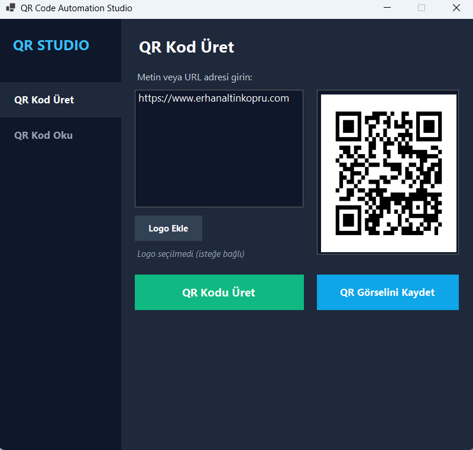
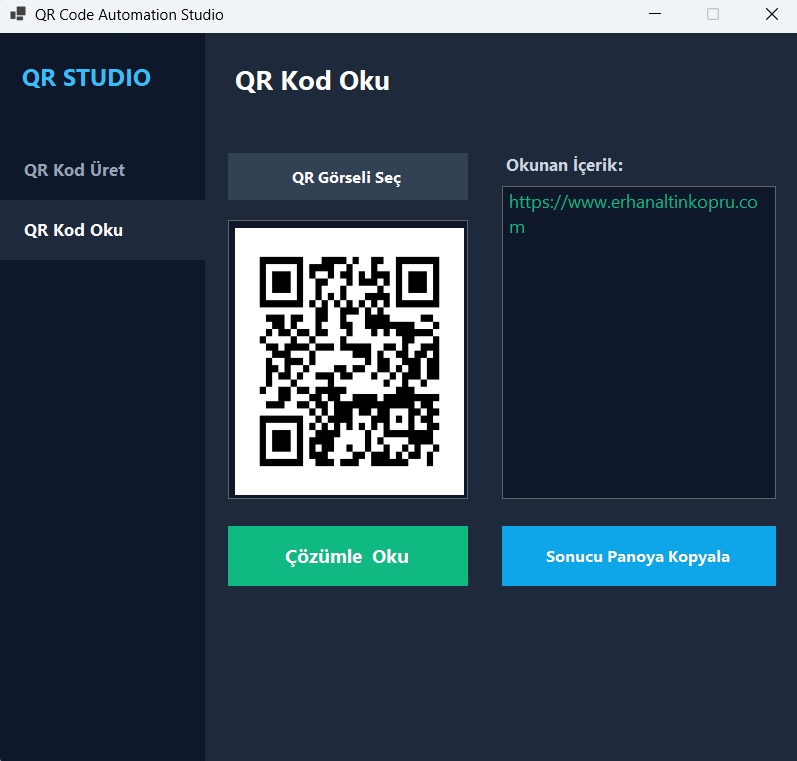

# QR Code Automation - C# WinForms Studio

C# (.NET) ile geliştirilmiş, QR kod üretme ve okuma işlemlerini gerçekleştiren şık, modern ve bağımsız bir masaüstü uygulaması. Otomasyon ve etiketleme projelerinde kullandığım QR kod üretim ve görüntü üzerinden çözümleme mantığının görsel arayüze sahip sürümüdür.

> [!NOTE]
> Bu uygulama herhangi bir PLC veya veritabanı bağlantısı içermez — sadece QR kod üretim ve görselden okuma mantığının masaüstü uygulamasındaki temel kullanımını gösterir. Gerçek endüstriyel entegrasyonlar için bkz. [plc-smm-barcode-scada](https://github.com/erhanaltinkopru/plc-smm-barcode-scada) reposu.

### 📥 Download / İndir
* **[QRCodeAutomation_v1.0.zip](QRCodeAutomation_v1.0.zip)** (Taşınabilir / Portable Windows x64 Sürümü)

---

## Screenshots / Uygulama Görselleri

| QR Code Generation / QR Kod Üretim | QR Code Reading / QR Kod Okuma |
| --- | --- |
|  |  |

| Generated Sample QR / Örnek QR Çıktısı |
| --- |
|  |

---

## Technical Features / Teknik Yetkinlikler

*   **QR Kod Üretimi (Generation)**: Metin veya URL adreslerini yüksek çözünürlüklü QR kod görsellerine (PNG) dönüştürür.
*   **Logo Entegrasyonu (Logo Embedding)**: QR kodun tam ortasına özel logo/görsel yerleştirir ve hata tolerans seviyesini (ECC) otomatik olarak en üst seviyeye (ECC Level H) çıkararak okunabilirliği korur.
*   **QR Kod Okuma (Reading)**: Bilgisayarınızdaki herhangi bir QR kod görselini (PNG/JPG/BMP) okuyup içeriğini çözer ve metin olarak konsol/arayüze yansıtır.
*   **Modern Arayüz (Modern UI)**: Koyu tema (Slate Dark) üzerine kurulmuş, sekmeli geçişlere sahip şık masaüstü arayüzü.

---

## Used Packages / Kullanılan Kütüphaneler

*   **QR Generation**: `QRCoder` NuGet library.
*   **QR Reading**: `ZXing.Net` & `ZXing.Net.Bindings.Windows.Compatibility` NuGet libraries (for System.Drawing Bitmap support).
*   **Target Framework**: `.NET 10.0-windows`

---

## How to Run / Nasıl Çalıştırılır

1. Projeyi bilgisayarınıza klonlayın.
2. Proje dizininde terminali açıp bağımlılıkları yükleyin ve uygulamayı çalıştırın:
   ```bash
   dotnet run
   ```
3. Arayüz üzerinden "QR Kod Üret" sekmesinden metin girip logonuzu ekleyerek test edebilirsiniz. "QR Kod Oku" sekmesinden ise diskteki QR görsellerini çözümleyebilirsiniz.

---
*Developed for educational desktop examples / Eğitim amaçlı masaüstü otomasyon örnekleri için geliştirilmiştir.*
